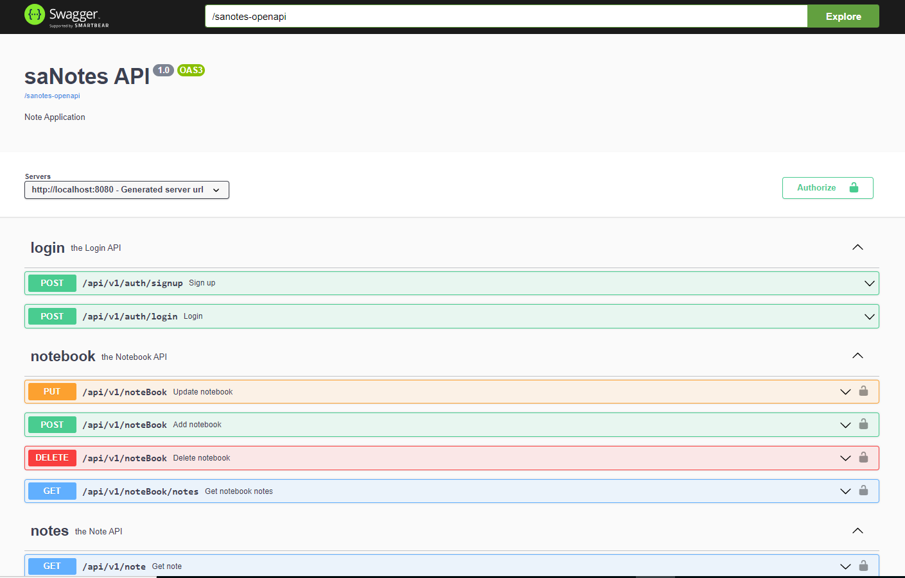

#
Sample Springboot Notes Application.
=======
<div id="top"></div>

<!-- PROJECT SHIELDS -->
[](https://circleci.com/gh/demirorens/sanotes/tree/main)
[](https://sonarcloud.io/summary/new_code?id=demirorens_sanotes)

<!-- PROJECT LOGO -->
<br />
<div align="center">
  <h3 align="center">Springboot Sample Note Application Rest API - SANotes</h3>

  <p align="center">
    A sample modular monolith project to learn Springboot
    <br />
    <br />
    <br />
    <a href="https://github.com/demirorens/sanotes/issues">Report Bug</a>
  </p>
</div>


<!-- TABLE OF CONTENTS -->
<details>
  <summary>Table of Contents</summary>
  <ol>
    <li>
      <a href="#about-the-project">About The Project</a>
    </li>
    <li>
      <a href="#getting-started">Getting Started</a>
    </li>
  </ol>
</details>


<!-- ABOUT THE PROJECT -->
## About The Project

Build Restful CRUD API for a Note Application using;
* Spring Boot,
* PostgreSQL,
* MongoDB
* Spring JPA and Hibernate.
* JWT
* OpenAPI 3.0 (Swagger 3)


<!-- GETTING STARTED -->
## Getting Started

To get a local copy up and running follow these simple steps.

### Prerequisites

* Clone the application

```sh
git clone https://github.com/demirorens/sanotes.git
```

### Installation Without Docker

1. Install PostgreSQL latest version
```sh
CREATE DATABASE sanotes;
```
or install and use pgAdmin

2. Install MongoDB latest version

3. Run the app using maven

```sh
mvn spring-boot:run
```
The app will start running at <http://localhost:8080>

insert roles to PostgreSQL
```sh
INSERT INTO roles VALUES (1,'ROLE_ADMIN'),(2,'ROLE_USER');
```

### Installation With Docker

1. In saNotesWeb directory simply run 
```sh
docker-compose up -d
```
The app will start running at <http://localhost:8080>

2.  Insert roles to PostgreSQL
```sh
INSERT INTO roles VALUES (1,'ROLE_ADMIN'),(2,'ROLE_USER');
```

<!-- USAGE EXAMPLES -->
## Usage

To inspect and use for the API just open the swagger-ui with below link
<http://localhost:8080/swagger-ui.html>



<p align="right">(<a href="#top">back to top</a>)</p>

